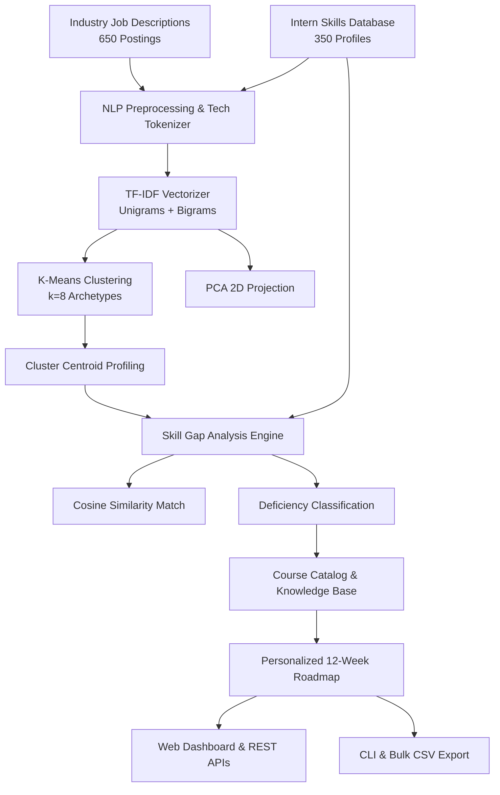

# SkillBridge AI: Intern Skills Analysis & Industry Demand Gap Identification

An enterprise-grade NLP and Machine Learning platform that analyzes intern skill sets against industry job descriptions, clusters market demands using **TF-IDF Vectorization** and **K-Means Clustering**, identifies critical competency deficiencies, and automatically generates personalized 12-week upskilling roadmaps.

---

## 🌟 Key Features

1. **Dual Dataset Architecture**:
   - **Intern Profiles Database** (`350+ records`): Profiles containing degree, university, target domain/role, proficiency levels (1-5), certifications, and resume summaries.
   - **Industry Job Descriptions** (`650+ postings`): Real-world tech job descriptions across 8 tech domains with required skills, preferred qualifications, tech stacks, and salary ranges.
2. **NLP & Clustering Engine (`TF-IDF + K-Means`)**:
   - **Domain-Specific Tokenization**: Preserves multi-word and technical terms (`C++`, `.NET`, `Node.js`, `CI/CD`, `REST APIs`, `scikit-learn`, `TCP/IP`, etc.).
   - **Sublinear TF-IDF Vectorization**: Unigram & bigram extraction with custom stop-word filtering.
   - **K-Means Clustering ($k=8$)**: Discovers 8 distinct industry career archetypes verified via Silhouette Score analysis.
   - **2D PCA Projection**: Transforms high-dimensional job and intern vectors into 2D coordinates for visual mapping.
3. **Skill Gap Diagnostics & Scoring Engine**:
   - **Cosine Similarity**: Measures semantic alignment between candidate vectors and industry cluster centroids.
   - **Set-Difference Skill Breakdown**: Isolates *Matched Skills*, *Missing Critical Skills*, *Missing Preferred Skills*, and *Proficiency Deficits*.
   - **Composite Readiness Score**: Formula weighting cosine similarity (40%), required skills match ratio (45%), and preferred bonus ratio (15%).
4. **Personalized 12-Week Upskilling Recommender**:
   - Maps missing skills to a curated course catalog (Coursera, edX, Udemy, DeepLearning.AI).
   - Generates a **3-Phase Structured Curriculum**:
     - **Phase 1: Core Fundamentals & Critical Deficiencies (Weeks 1-4)**
     - **Phase 2: Applied Frameworks & Proficiency Upgrades (Weeks 5-8)**
     - **Phase 3: Production Projects, Specialization & Certifications (Weeks 9-12)**
5. **Interactive Web Dashboard & Live Simulator**:
   - Responsive, dark/light glassmorphic UI.
   - 2D PCA Cluster Map and Competency Radar/Spider charts.
   - Live Resume / Skill Gap Simulator where students can test custom skills and receive instant roadmaps.
6. **Command-Line Interface (CLI)**:
   - Full CLI support for batch training, cluster inspection, intern gap queries, and CSV report export.

---

## 🏗️ System Architecture



---

## 🚀 Quick Start

### 1. Requirements & Installation
Ensure Python 3.10+ is installed. Clone the repository and install dependencies:
```bash
pip install -r requirements.txt
```

### 2. Generate Datasets & Train Pipeline
```bash
# Generate 350 intern profiles and 650 industry job postings
python src/generate_data.py

# Train NLP TF-IDF and K-Means Clustering model
python src/nlp_clustering_pipeline.py
```

### 3. Launch Interactive Web Dashboard
```bash
python run.py
```
Open your browser and navigate to: **`http://127.0.0.1:5000`**

---

## 💻 CLI Usage

The platform provides a command-line interface for batch processing and automated reports:

| Command | Description |
| :--- | :--- |
| `python src/cli.py clusters` | Display all 8 discovered K-Means clusters and centroid terms |
| `python src/cli.py analyze-intern <ID>` | Run gap analysis & 12-week roadmap for an intern (e.g. `INT-1001`) |
| `python src/cli.py analyze-custom --skills "..." --role "..."` | Run live skill gap analysis on custom skills |
| `python src/cli.py export-summary` | Export bulk gap analysis of all interns to `data/intern_gap_analysis_report.csv` |
| `python src/cli.py train --clusters 8` | Retrain pipeline with custom cluster count |

---

## 🧪 Automated Testing
Run the complete automated test suite (12 unit and integration tests):
```bash
python -m unittest tests/test_pipeline.py
```

---

## 📊 Discovered Industry Clusters

1. **AI & Machine Learning**: Python, TensorFlow, PyTorch, scikit-learn, MLOps, LLMs.
2. **Full Stack Web Development**: JavaScript, TypeScript, React, Node.js, Next.js, REST APIs.
3. **Cloud Architecture & DevOps**: Linux, Docker, Kubernetes, CI/CD, Terraform, AWS.
4. **Cybersecurity & Network Defense**: Network Security, Linux, Cryptography, SIEM, OWASP.
5. **Mobile Application Development**: Flutter, Dart, Swift, Kotlin, React Native, Mobile UI.
6. **Data Engineering & Big Data**: SQL, Python, ETL, Apache Spark, Airflow, Snowflake.
7. **Business Intelligence & Analytics**: SQL, Tableau, Power BI, Statistics, EDA, DAX.
8. **Embedded Systems & IoT**: C, C++, Microcontrollers, RTOS, FreeRTOS, Embedded Linux.

---

## 📁 Repository Structure
```
task5/
├── data/                               # Generated datasets & JSON catalogs
│   ├── interns_skills.csv              # 350 Intern candidate profiles
│   ├── industry_jobs.csv               # 650 Industry job postings
│   ├── skills_taxonomy.json            # Categorized skills taxonomy
│   ├── course_catalog.json             # 39 curated courses, projects & certs
│   └── intern_gap_analysis_report.csv  # Bulk export report
├── models/                             # Trained models & pipeline artifacts
│   ├── tfidf_vectorizer.joblib         # Fitted TF-IDF model
│   ├── kmeans_model.joblib             # Fitted K-Means model
│   ├── pca_transformer.joblib          # Fitted PCA 2D model
│   └── pipeline_artifacts.joblib       # Metadata & precomputed vectors
├── src/                                # Source code
│   ├── generate_data.py                # Dataset synthesizer
│   ├── nlp_clustering_pipeline.py      # Core NLP, TF-IDF, K-Means & Gap Engine
│   ├── app.py                          # Flask backend & REST APIs
│   └── cli.py                          # Command-line interface
├── static/                             # Frontend assets
│   ├── css/styles.css                  # Dark/light glassmorphic stylesheet
│   └── js/app.js                       # Chart.js visualizer & API controller
├── templates/                          # HTML5 templates
│   └── index.html                      # Single-page dashboard template
├── tests/                              # Automated test suite
│   └── test_pipeline.py                # Unit & integration tests
├── project_report.md                   # Comprehensive project documentation
├── requirements.txt                    # Python dependencies
└── run.py                              # Main application entry point
```
